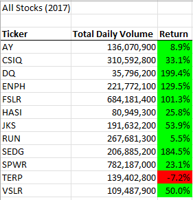
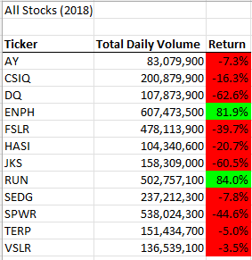
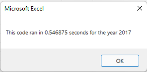
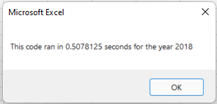
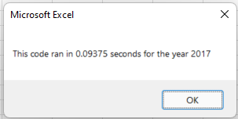
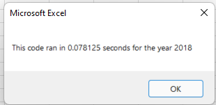

# Overview of Project
The purpose of this analysis is to assist client Steve with determining which green energy stocks performed best in the years 2017 and 2018, so that he may advise his first clients on their next financial move. This was accomplished by analyzing the clients' first pick, stock DQ (DAQO). After our analysis, it was shown that the stock experienced a 63% decrease in its return value in 2018, which revealed DQ as an unfavorable option for investment. We then performed an analysis on the 11 other stocks to see their rates of return across the years 2017 and 2018, and far better options were found: namely ENPH and RUN, which both experienced growth in the years 2017 and 2018. After our analysis was completed, the code was refactored from the original script to optimize run time performance. That refactored code is presented below.

# Refactored VBA Script Code

    Sub AllStocksAnalysisRefactored()
    Dim startTime As Single
    Dim endTime  As Single

    yearValue = InputBox("What year would you like to run the analysis on?")

    startTime = Timer
    
    'Format the output sheet on All Stocks Analysis worksheet
    Worksheets("All Stocks Analysis").Activate
    
    Range("A1").Value = "All Stocks (" + yearValue + ")"
    
    'Create a header row
    Cells(3, 1).Value = "Ticker"
    Cells(3, 2).Value = "Total Daily Volume"
    Cells(3, 3).Value = "Return"

    'Initialize array of all tickers
    Dim tickers(12) As String
    
    tickers(0) = "AY"
    tickers(1) = "CSIQ"
    tickers(2) = "DQ"
    tickers(3) = "ENPH"
    tickers(4) = "FSLR"
    tickers(5) = "HASI"
    tickers(6) = "JKS"
    tickers(7) = "RUN"
    tickers(8) = "SEDG"
    tickers(9) = "SPWR"
    tickers(10) = "TERP"
    tickers(11) = "VSLR"
    
    'Activate data worksheet
    Worksheets(yearValue).Activate
    
    'Get the number of rows to loop over
    RowCount = Cells(Rows.Count, "A").End(xlUp).Row
    
    '1a) Create a ticker Index
    tickerIndex = 0

    '1b) Create three output arrays
    Dim tickerVolumes(12) As Long
    Dim tickerStartingPrices(12) As Single
    Dim tickerEndingPrices(12) As Single
    
    ''2a) Create a for loop to initialize the tickerVolumes to zero.
    For i = 0 To 11
    tickerVolumes(i) = 0
    Next i
        
    ''2b) Loop over all the rows in the spreadsheet.
    For i = 2 To RowCount
    
        '3a) Increase volume for current ticker
        tickerVolumes(tickerIndex) = tickerVolumes(tickerIndex) + Cells(i, 8).Value
        
        '3b) Check if the current row is the first row with the selected tickerIndex.
        If Cells(i, 1).Value = tickers(tickerIndex) And Cells(i - 1, 1).Value <> tickers(tickerIndex) Then
            
            tickerStartingPrices(tickerIndex) = Cells(i, 6).Value
            
        End If
        
        '3c) check if the current row is the last row with the selected ticker
         'If the next row’s ticker doesn’t match, increase the tickerIndex.
        If Cells(i, 1).Value = tickers(tickerIndex) And Cells(i + 1, 1).Value <> tickers(tickerIndex) Then
            
            tickerEndingPrices(tickerIndex) = Cells(i, 6).Value
            
        End If
        
            '3d Increase the tickerIndex.
            If Cells(i, 1).Value = tickers(tickerIndex) And Cells(i + 1, 1).Value <> tickers(tickerIndex) Then
            tickerIndex = tickerIndex + 1
            
            End If
    
    Next i
    
    '4) Loop through your arrays to output the Ticker, Total Daily Volume, and Return.
    For i = 0 To 11
        
        Worksheets("All Stocks Analysis").Activate
        Cells(4 + i, 1).Value = tickers(i)
        Cells(4 + i, 2).Value = tickerVolumes(i)
        Cells(4 + i, 3).Value = tickerEndingPrices(i) / tickerStartingPrices(i) - 1
        
    Next i
    
    'Formatting
    Worksheets("All Stocks Analysis").Activate
    Range("A3:C3").Font.FontStyle = "Bold"
    Range("A3:C3").Borders(xlEdgeBottom).LineStyle = xlContinuous
    Range("B4:B15").NumberFormat = "#,##0"
    Range("C4:C15").NumberFormat = "0.0%"
    Columns("B").AutoFit

    dataRowStart = 4
    dataRowEnd = 15

    For i = dataRowStart To dataRowEnd
        
        If Cells(i, 3) > 0 Then
            
            Cells(i, 3).Interior.Color = vbGreen
            
        Else
        
            Cells(i, 3).Interior.Color = vbRed
            
        End If
        
    Next i
 
    endTime = Timer
    MsgBox "This code ran in " & (endTime - startTime) & " seconds for the year " & (yearValue)

    End Sub

# Results
## Stock Performance in 2017

In 2017, all stocks analyzed experienced growth except for TERP, which experienced a 7.2% loss in return. The most significant increase was for DQ, which experienced a 199.4% increase. Also notable was SEDG and ENPH, which increased their return value by 184.5% and 129.5% respectively.

## Stock Performance in 2018

In 2018, conversely, most stocks experienced a decrease in return value except for ENPH and RUN, which both increased by over 80%. Notably, RUN performed better in 2018 than it did in 2017, with its increase in return jumping from 5.5% to 84%. ENPH also experienced significant growth, however it did increase its return value more in 2017 than it did in 2018; 129.5% in 2017 compared to 81.9% in 2018.

## Intial Script Execution Times
### 2017

### 2018

## Refactored Script Execution Times
### 2017

### 2018

# Summary
## Advantages or Disadvantages of Refactoring Code in General
### Advantages
The advantages to refactoring code can be significant; by increasing the overall efficacy of the code you not only are able to decrease the run time of the script, you are also able to provide code that is easier to edit and easier to read. Sometimes when code is initially written it works well, but there are areas where it could be improved and streamlined. Refactoring code is a great way to double-check your work for optimal efficiency and cleanliness.

### Disadvantages
A disadvantage worth noting when refactoring code in general is the human element; when we try to edit something that already works, there is significant opportunity for us to accidentally discard an important part of the script which will cause the script to stop working entirely. A simple forgotten variable could be enough to cause an otherwise perfectly written script to no longer work.

## Advantages of the Refactored VBA Script
When refactoring this particular script, a notable advantage was a reduction in run time. Initially, the 2017 analysis took 0.55 seconds to run. After refactoring, the script ran in 0.09 seconds. For 2018, the initial analysis took 0.51 seconds to run. After refactoring, this script ran in a mere 0.08 seconds. The reason for this decrease in run time is due to a reduction in loops; in previous iterations of the script the data was being looped through twice. After refactoring, we retrieved all the data needed by only looping through once. 

Another advantage to this refactored code is its readability. This code is far easier to read and edit. If the client came back with further data to analyze, it would be very easy to appropriate the code we already have to analyze data for additional years and stocks. 

## Disadvantages of the Refactored VBA Script
As stated above, a clear disadvantage to refactoring code is the opportunity for important blocks of code to be deleted or misplaced. In addition, it is worth noting that refactoring code is a time-consuming endeavor which may or may not be fruitful. In this case it was fruitful as we decreased the run time and increased the readability, but that may not always be the case going forward. 
